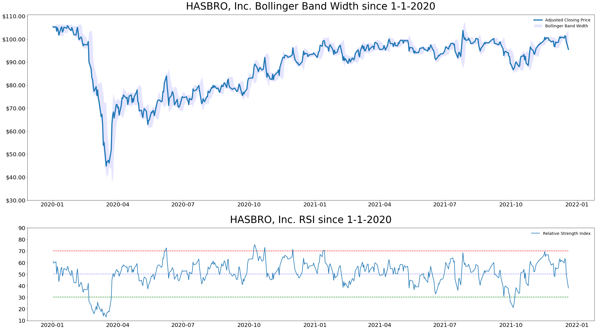
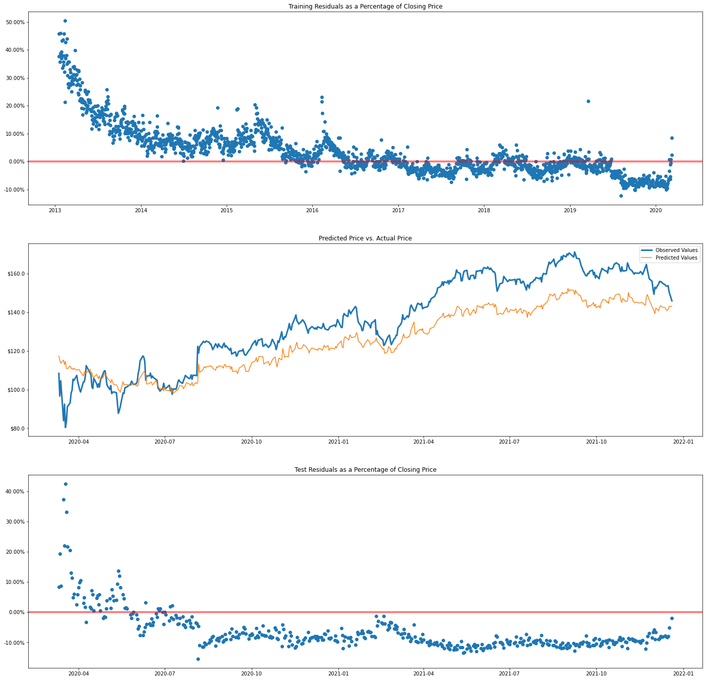
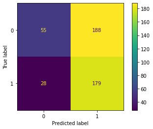

# Market Machine Learning
[TJ Bray](https://www.linkedin.com/in/thomas-tj-bray-24499354/) Capstone Project for Flatiron School

## Overview

Machine learning techniques used for predicting stock prices involve analyzing historical data to forecast future performance. This is done by looking at patterns in the data which includes current and past information and finding the best fit predictive models. Machine learning modeling can be done with a multitude of different algorithms and associated parameters and/or hyperparameters. These predictive models can be used by investors to be make informed investment decisions that will provide them with higher returns while minimizing losses. In recent years, the continued development of machine learning has provided a greater level of model performance for stock price prediction.

This project seeks to use historical data in order to create models that can predict the price movement of stocks in order to make better investment decisions.

## Business Objective
This project seeks to create models using different machine learning algoritihms that can predict the price movements of a stock on a given day.

## Data
For this project, I will be using stock market data gathered from multiple sources. The company data comes from [Paul Mooney's](https://www.kaggle.com/paultimothymooney) [Stock Market Dataset](https://www.kaggle.com/paultimothymooney/stock-market-data). The S&P 500 index data has been gathered from [Larxel's](https://www.kaggle.com/andrewmvd) [S&P 500](https://www.kaggle.com/andrewmvd/sp-500-stocks?select=sp500_index.csv) dataset. Macroeconomic data has been sourced from [Calven Ng's](https://www.kaggle.com/calven22) [USA Key Economic Indicators](https://www.kaggle.com/calven22/usa-key-macroeconomic-indicators) dataset. I have also included API calls using [UniBit](https://unibit.ai/solution).

I calculate multiple different technical indicators in order to further my analysis:
1. Relative Strength Index which is a measurement of momentum.
2. Moving Averages, both simple and exponential.
3. Bollinger Bands which is a measure of volatility. 

For the S&P 500 Index, I calculate the technical indicators as well.
Macroeconomic Factors I include in my data are Personal Savings Rate, M2 Money Supply, Core Consumer Price Index, Disposable Personal Income, Treasury Rate, Federal Funds Rate, and Industrial Production.

Due to time and processing constraints, I used a random group of 75 companies to train and test my models on.

## Methodology
I use 6 different model types throughout this project. These models are compared against a baseline model of the stock continuing to move in the same direction it moved a majority of the time in the training set.

- The Regression Models are: Elastic Net, Support Vector Regression, and Ridge Regression. 
- The Classification Models are: Logistic Regression, Decision Tree, and XGBoost. 

## Results 
The regression models did not provide usable predictive models. The test residuals were only normally distributed 8 out 225 times. This means that the model does not explain all the trends in the dataset. One of the models with normally distributed residuals was the Support Vector Regression of Assurant, Inc. (AIZ). As you can see, there are trends in the residual plots, as well as predicted values that do not align closely with the observed values.

There was a bit more success with classification models as they are only predicting binary outcomes. The best model predicted Biogen Inc (BIIB) correctly 52% of the time which was 6% above the baseline. Further analysis should be done with models that outperformed in order to determine their longterm viability.

## Conclusions and Next Steps
No one size fits all model exists in this project. Further analysis should be done to determine the long term viability of the models I've created.

Next steps should include:
- Natural Language processing to determine Wall St. sentiment towards given stocks.
- Sector specific analysis.
- Using rolling regressions to test model accuracy on a testing set of one day at a time.
- Add a third category, sideways movement, to the Classification Models. Set limits around ~1% that would indicate predicted sideways movement throughout the day.

### For More Information
Please review my full analysis in my [Jupyter Notebook](MainNotebook.ipynb) or [presentation deck](Project_Presentation.pdf).
